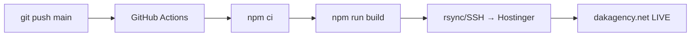

# DAK Agency Website — Documento de Contexto Completo

> **Última verificación:** 12 de junio de 2026  
> **Branch:** `main` — sincronizado con `origin/main`  
> **Último commit:** `12404f8` — *fix: contact layout, blog contrast, services card, projects title*  
> **Repositorio:** [github.com/KevinVv18/dak-agency-website](https://github.com/KevinVv18/dak-agency-website)

> [!IMPORTANT]
> **Actualizado el 21-jun-2026** con cambios de código, la iniciativa de automatización del blog y el **dilema del sandbox**. Lo más reciente y relevante para continuar está en las **secciones 16 a 19** al final. Hay cambios de código **pendientes de commit/deploy**.

---

## 1. Identidad del Proyecto

| Campo | Valor |
|-------|-------|
| **Nombre** | DAK Agency Website |
| **Dominio** | [dakagency.net](https://dakagency.net/) |
| **Tipo** | Sitio web corporativo SPA + Blog WordPress |
| **Negocio** | Agencia de marketing digital en La Victoria, Chiclayo, Lambayeque, Perú |
| **Teléfono** | +51 906 765 040 |
| **Email** | marketing@dakagency.net |
| **Redes** | [Facebook](https://www.facebook.com/profile.php?id=61577374078273), [Instagram](https://www.instagram.com/agency_dak/), [TikTok](https://www.tiktok.com/@dakagency) |

### Servicios que ofrece la agencia:
1. Branding
2. Fotografía
3. Video
4. Social Media
5. Diseño Web
6. SEO & Ads
7. Automatización

### Clientes actuales:
- Berse Line (Spa & Wellness)
- Gran Oportunidad GO! (Retail & Promociones)
- Dra. Jenny (Salud & Medicina)
- Manuel Pardo (Educación)
- Prosadis (Salud Dental)
- Spa Kreativos (Spa & Wellness)

---

## 2. Stack Tecnológico

| Tecnología | Versión | Propósito |
|-----------|---------|-----------|
| **React** | 18.3.1 | Librería UI |
| **Vite** | 5.2.11 | Build tool + dev server |
| **Framer Motion** | 11.0.8 | Animaciones |
| **EmailJS** | 4.4.1 (`@emailjs/browser`) | Envío de emails desde el cliente |
| **React Router DOM** | (dependencia) | Routing SPA |
| **Node.js** | 20 (CI) | Runtime para build |
| **CSS** | Vanilla (CSS Variables) | Estilos, sin frameworks CSS |

> [!IMPORTANT]
> **NO usa Tailwind**, no usa TypeScript de runtime (solo `@types/*` para editor hints). El estilo es 100% vanilla CSS con variables globales.

---

## 3. Estructura del Proyecto

```
dak-agency-website/
├── .env.example                # Variables de entorno ejemplo
├── .eslintrc.cjs               # Config ESLint
├── .github/
│   └── workflows/
│       └── deploy.yml          # GitHub Actions: auto-deploy a Hostinger
├── .hostinger/
│   └── deploy.sh               # Script post-build para WordPress
├── .gitignore
├── favicon.svg
├── index.html                  # Entry HTML con SEO completo + JSON-LD
├── package.json
├── vite.config.js              # Puerto 3000, auto-open
├── public/
│   ├── .htaccess               # Rewrite rules (SPA + WordPress)
│   ├── robots.txt              # SEO robots
│   └── images/                 # Imágenes estáticas (web_design.png, seo_ads.png, automation.png)
├── scripts/
│   ├── setup-wordpress.sh      # Script setup WordPress
│   └── wp-config.template.php  # Template wp-config
├── src/
│   ├── main.jsx                # Entry point React
│   ├── App.jsx                 # Root component + routing
│   ├── index.css               # Design system global (variables, reset, utilities)
│   ├── assets/                 # Imágenes y logos
│   │   ├── logo.svg            # Logo principal
│   │   ├── logo-nav.svg        # Logo para navbar
│   │   ├── banners/            # 4 banners de portada
│   │   ├── clients/            # Imágenes por cliente (berseline, go, jeny, pardo, prosadis, spa)
│   │   ├── dak/                # Showcase DAK (fotografía, dron, inmobiliario, sephora, skincare, veterinaria)
│   │   ├── gallery/            # Fotografías profesionales
│   │   ├── logos/              # Logos de clientes
│   │   └── projects/           # Imágenes de proyectos
│   ├── components/             # 14 componentes (JSX + CSS cada uno)
│   ├── config/
│   │   └── emailjs.js          # Configuración EmailJS
│   ├── data/
│   │   ├── portfolioData.js    # Data de clientes y banners
│   │   └── galleryData.js      # Data de galería, categorías, fotos
│   ├── hooks/
│   │   └── useWordPressPosts.js # Hook para API REST de WordPress
│   └── pages/
│       ├── Home.jsx            # Página principal
│       └── GalleryPage.jsx     # Página de galería
└── wordpress-theme/
    └── dak-informando/         # Tema WordPress custom
        ├── style.css
        ├── functions.php
        ├── header.php
        ├── footer.php
        ├── front-page.php
        ├── single.php
        ├── index.php
        ├── assets/
        └── template-parts/
```

---

## 4. Arquitectura de la Aplicación

### Routing (React Router DOM — BrowserRouter)

| Ruta | Página | Componentes |
|------|--------|------------|
| `/` | `Home` | Hero → CTASection → Services → Projects → PhotoGallery → Blog → ContactForm |
| `/gallery` | `GalleryPage` | Gallery (masonry completo) |
| `/blog/*` | WordPress | Servido directamente por WordPress (no pasa por React) |

### Componentes globales (siempre visibles):
- **Navigation** — Navbar fija con scroll-aware, menú mobile hamburger
- **Footer** — 3 columnas (brand, nav, mapa), marquee ticker
- **ChatWidget** — Chat bot conversacional flotante (esquina inferior derecha)
- **Cursor Grid Reveal** — Efecto visual de grilla que sigue al mouse

### Layout del `App.jsx`:
```jsx
<BrowserRouter>
  <div className="app">
    <div className="cursor-grid-reveal" />  {/* Efecto mouse */}
    <Navigation />
    <main>
      <Routes>
        <Route path="/" element={<Home />} />
        <Route path="/gallery" element={<GalleryPage />} />
      </Routes>
    </main>
    <Footer />
    <ChatWidget />
  </div>
</BrowserRouter>
```

---

## 5. Componentes — Detalle

### Página Home (`/`)

| # | Componente | Archivo | Descripción |
|---|-----------|---------|-------------|
| — | **Hero** | `Hero.jsx` + `Hero.css` | Logo SVG grande, carrusel de logos de clientes, CTA "Comenzar Proyecto", botón agendar reunión, redes sociales, decoraciones animadas |
| — | **CTASection** | `CTASection.jsx` + `CTASection.css` | Sección call-to-action con imágenes flotantes dispersas |
| 01 | **Services** | `Services.jsx` + `Services.css` | **Componente más complejo** (~760 líneas). Showcase de 7 servicios con video/imagen de fondo. Desktop: miniaturas + sidebar. Mobile: flechas + drawer. **(21-jun-2026)** Cada servicio soporta `videoDesktop` (16:9) y `videoMobile` (9:16) con helper `getServiceVideo()` — ver §16.1 |
| 02 | **Projects** | `Projects.jsx` + `Projects.css` | **(21-jun-2026)** Reducido a **4 layouts** (hero, minimal, filmstrip, scattered) y **4 clientes destacados** + CTA a `/gallery`. Se eliminaron `mosaic` y `split`. Mobile: mHero/mMosaic/mCard. Ver §16.1 |
| 03 | **PhotoGallery** | `PhotoGallery.jsx` + `PhotoGallery.css` | Galería de fotos con preview en la home |
| 04 | **Blog** | `Blog.jsx` + `Blog.css` | Grilla de posts cargados desde WordPress REST API. Skeleton loading, manejo de errores |
| 05 | **ContactForm** | `ContactForm.jsx` + `ContactForm.css` | Formulario con validación + EmailJS (doble envío: notificación + auto-reply). Layout 2 columnas: info + formulario |

### Componentes de soporte

| Componente | Descripción |
|-----------|-------------|
| **Navigation** | Navbar con logo, 6 links (Servicios, Proyectos, Galería, Blog, Nosotros, Contacto), CTA button, hamburger mobile. Maneja navegación SPA (anchors `#`) y routes (`/gallery`) |
| **ChatWidget** | Bot conversacional multi-step: Greeting → Servicios → Nombre → Email → Phone → Mensaje → Envío a API → Done. Incluye botón WhatsApp y "Agendar reunión" |
| **Footer** | Marquee con servicios, 3 columnas (brand + links + mapa Google), links legales, botón "back to top" |
| **Gallery** | Página completa de galería con hero de imágenes DAK, filtrado por categorías, masonry grid, lightbox |
| **Carousel** | Componente carrusel reutilizable |
| **LiquidLogo** | Efecto líquido sobre el logo SVG |

---

## 6. APIs e Integraciones

### 6.1 EmailJS (Formulario de Contacto)

**Propósito:** Enviar emails directamente desde el navegador sin backend propio.

| Parámetro | Variable de entorno |
|-----------|-------------------|
| Public Key | `VITE_EMAILJS_PUBLIC_KEY` |
| Service ID | `VITE_EMAILJS_SERVICE_ID` |
| Template Notificación | `VITE_EMAILJS_TEMPLATE_NOTIFICATION` |
| Template Auto-reply | `VITE_EMAILJS_TEMPLATE_AUTOREPLY` |

**Flujo:**
1. Usuario llena formulario (nombre, email, servicio, mensaje)
2. Se envía email de notificación a `marketing@dakagency.net`
3. Se envía email de confirmación automática al cliente
4. Ambos usan `emailjs.send()` del paquete `@emailjs/browser`

**Template params enviados:**
```js
{
  from_name, from_email, service, message,
  to_email: 'marketing@dakagency.net',
  reply_to: formData.email
}
```

### 6.2 WordPress REST API (Blog)

**Endpoint:** `https://dakagency.net/blog/wp-json/wp/v2/posts`

**Hook:** `useWordPressPosts(limit)`

```js
// Ejemplo de llamada
fetch(`https://dakagency.net/blog/wp-json/wp/v2/posts?per_page=${limit}&_embed`)
```

**Datos formateados devueltos:**
```js
{ id, title, excerpt, date, link, featuredImage, categories, author }
```

> [!NOTE]
> El link de WordPress se convierte de absoluto a relativo para mantener navegación dentro del sitio. El blog WordPress vive en `/blog/` y se excluye del routing SPA.

### 6.3 API de Leads (Chat Widget)

**Base URL:** `VITE_API_URL` → `https://admin.dakagency.net`

**Endpoint:** `POST /api/leads`

**Body:**
```json
{
  "nombre": "...",
  "email": "...",
  "telefono": "...",
  "servicio": "...",
  "mensaje": "...",
  "fuente": "website-chat",
  "fecha": "2026-06-12T..."
}
```

> [!WARNING]
> Si la API falla, el chat widget muestra un fallback con WhatsApp como contacto alternativo. No bloquea la experiencia del usuario.

### 6.4 Cloudflare / Cloudinary (Media)

- **Videos de servicios** se sirven desde **Cloudinary**: `res.cloudinary.com/dm4ijuzmi/video/upload/...`
- Algunos servicios usan imágenes estáticas locales (`/images/web_design.png`, etc.) en lugar de video

### 6.5 Enlaces externos

| Destino | URL |
|---------|-----|
| Agendar reunión | `https://plan.dakagency.net/agendar.html` |
| Cotizar paquetes | `https://plan.dakagency.net` |
| WhatsApp | `https://api.whatsapp.com/send/?phone=51906765040` |

---

## 7. Variables de Entorno

Archivo: `.env.local` (NO se commitea)

```env
VITE_EMAILJS_PUBLIC_KEY=QtRdYOqHr4-zNgIUY
VITE_EMAILJS_SERVICE_ID=service_feg2or7
VITE_EMAILJS_TEMPLATE_NOTIFICATION=template_9rfcj3j
VITE_EMAILJS_TEMPLATE_AUTOREPLY=template_y7y363r
VITE_API_URL=https://admin.dakagency.net
```

> [!CAUTION]
> Los valores reales están en el comentario dentro de `src/config/emailjs.js`. El `.env.example` contiene placeholders genéricos.

---

## 8. Sistema de Diseño (CSS)

### Paleta de colores principal

| Variable | Valor | Uso |
|----------|-------|-----|
| `--color-primary` | `#030106` | Negro profundo (fondo) |
| `--color-secondary` | `#B024FF` | Púrpura brillante (acento principal) |
| `--color-accent` | `#B024FF` | Mismo púrpura |
| `--color-white` | `#ffffff` | Texto principal |

### Colores por servicio

| Servicio | Color |
|----------|-------|
| Branding | `#B024FF` |
| Fotografía | `#00C8C8` |
| Video | `#00B478` |
| Social Media | `#D4A574` |
| Diseño Web | `#FF6B35` |
| SEO & Ads | `#4A90E2` |
| Automatización | `#9B59B6` |

### Tipografía
- Font stack del sistema: `-apple-system, BlinkMacSystemFont, 'Segoe UI', 'Roboto'...`
- Headings con `clamp()` para responsive (ej: `h1: clamp(3rem, 8vw, 8rem)`)
- Font weights: 600-900

### Breakpoints
- **Mobile:** `< 768px`
- **Tablet:** `768px - 1024px`
- **Desktop:** `> 1024px`

### Efectos visuales
- **Cursor Grid Reveal:** Grilla SVG que aparece alrededor del mouse (desktop only)
- **Glow effects** con `box-shadow` púrpura
- **Gradientes** lineales con el color brand
- **Animaciones:** fadeIn, slideUp, pulse, parallax scrolling
- **`prefers-reduced-motion`** respetado

---

## 9. Deployment / CI-CD

### Pipeline (automatizado)



### GitHub Actions Workflow (`.github/workflows/deploy.yml`)

- **Trigger:** Push a `main`
- **Runner:** `ubuntu-latest`
- **Node:** v20
- **Build:** `npm run build` (que ejecuta `vite build && bash .hostinger/deploy.sh`)
- **Deploy:** `rsync -avz --delete --exclude='blog/' --exclude='.builds/'`
- **Destino:** `/home/u567580447/domains/dakagency.net/public_html/`

### Script post-build (`.hostinger/deploy.sh`)

1. **SAVE:** Respalda WordPress live (`public_html/blog/`) a `/home/u567580447/wordpress_blog/`
2. **COPY:** Copia el respaldo a `dist/blog/`
3. **THEME:** Actualiza tema `dak-informando` desde el repo

> [!IMPORTANT]
> El `--exclude='blog/'` en rsync es **CRÍTICO** para no borrar WordPress durante deploy. El blog se preserva independientemente.

### Hosting

| Concepto | Detalle |
|----------|---------|
| **Proveedor** | Hostinger |
| **IP** | `89.116.115.11` |
| **Puerto SSH** | `65002` |
| **Usuario** | `u567580447` |
| **Path** | `/home/u567580447/domains/dakagency.net/public_html/` |
| **Secret requerido** | `SSH_PRIVATE_KEY` (en GitHub Secrets) |

### Cómo subir cambios

```bash
# 1. Hacer cambios
# 2. Commit y push
git add .
git commit -m "feat: descripción del cambio"
git push origin main

# El deploy es AUTOMÁTICO vía GitHub Actions
```

### Build local (sin deploy)

```bash
npm run local-build    # Solo vite build, sin deploy.sh
```

---

## 10. WordPress — Blog integrado

### Ubicación
- **URL:** `https://dakagency.net/blog/`
- **Tema custom:** `wordpress-theme/dak-informando/`
- **Archivos del tema:** `style.css`, `functions.php`, `header.php`, `footer.php`, `front-page.php`, `single.php`, `index.php`

### Coexistencia SPA + WordPress
El `.htaccess` en `public/` maneja esto:
```apache
# WordPress: pasa todo /blog/ a WordPress
RewriteRule ^blog(/.*)?$ - [L]

# SPA: todo lo demás va a index.html
RewriteRule . /index.html [L]
```

### Integración con React
- El componente `Blog.jsx` usa el hook `useWordPressPosts()` para cargar posts vía REST API
- Los posts se muestran como tarjetas en la home, con link al blog WordPress

---

## 11. SEO

### Meta tags (`index.html`)
- Title, description, keywords en español
- Open Graph (Facebook/WhatsApp)
- Twitter Cards
- Schema.org JSON-LD (`MarketingAgency`)
- Canonical URL: `https://dakagency.net/`

### robots.txt
- Permite crawling general
- Bloquea `wp-admin/`, `wp-login.php`, `wp-includes/`
- Bloquea bots de scraping (AhrefsBot, SemrushBot, etc.)
- Sitemap: `https://dakagency.net/blog/sitemap_index.xml`

### .htaccess
- Security headers (`X-Content-Type-Options`, `X-Frame-Options`, `X-XSS-Protection`)
- Cache de assets estáticos (imágenes 1 año, CSS/JS 1 mes)

---

## 12. Comandos de Desarrollo

```bash
# Instalar dependencias
npm install

# Desarrollo local (puerto 3000, auto-open)
npm run dev

# Build producción (+ intenta deploy)
npm run build

# Build local sin deploy
npm run local-build

# Preview del build
npm run preview
```

---

## 13. Patrones y Convenciones

### Estructura de componentes
- Cada componente tiene su `.jsx` + `.css` en `src/components/`
- Imports de CSS propios al inicio del componente
- Animaciones con Framer Motion (`motion.div`, `useInView`, `AnimatePresence`)
- Responsive handling: `useEffect` con `window.innerWidth <= 768` → `isMobile` state

### Data
- Los datos de clientes/portfolio están en `src/data/portfolioData.js`
- Los datos de galería están en `src/data/galleryData.js`
- Imports de imágenes usan imports estáticos de ES modules (Vite los optimiza)

### Navegación interna
- Links anchor (`#services`, `#projects`, etc.) → `scrollIntoView({ behavior: 'smooth' })`
- Links de ruta (`/gallery`) → `navigate()` de React Router
- Si estás en `/gallery` y clickeas un anchor → primero navega a `/`, espera 100ms, luego scroll

### Idioma
- Todo el contenido visible está en **español**
- Código y comentarios mezclados español/inglés

---

## 14. Dependencias completas

### Producción
```json
{
  "@emailjs/browser": "^4.4.1",
  "framer-motion": "^11.0.8",
  "react": "^18.3.1",
  "react-dom": "^18.3.1",
  "react-router-dom": "installed"
}
```

### Desarrollo
```json
{
  "@types/react": "^18.3.1",
  "@types/react-dom": "^18.3.0",
  "@vitejs/plugin-react": "^4.3.0",
  "vite": "^5.2.11"
}
```

---

## 15. Notas Importantes para IAs

> [!TIP]
> **Para editar estilos globales:** Modificar `src/index.css` (variables CSS en `:root`)  
> **Para agregar un nuevo servicio:** Editar el array `services` dentro de `Services.jsx` y agregar video/imagen correspondiente  
> **Para agregar un cliente:** Editar `src/data/portfolioData.js` y `src/data/galleryData.js`, agregar imágenes en `src/assets/clients/`  
> **Para cambiar colores brand:** Editar las CSS variables en `src/index.css` bajo `:root`

> [!WARNING]
> - **NO borrar `/blog/`** durante deploys — WordPress vive ahí  
> - **NO commitear `.env.local`** — contiene claves de EmailJS  
> - Los videos de Cloudinary son externos; si se caen, los servicios 1-4 pierden su fondo  
> - `react-router-dom` aparece en el código pero **no está explícitamente en package.json** — se instala como dependencia transitiva o podría haberse instalado manualmente

> [!NOTE]
> El proyecto no tiene tests automatizados. No hay i18n formal. No hay state management global (todo es local state con useState). No hay SSR — es una SPA pura servida como archivos estáticos.

---

## 16. Registro de Sesión — 21 de junio de 2026 (cambios y aprendizajes)

### 16.1 Cambios de código (PENDIENTES de commit/deploy)

**`Projects.jsx` + `Projects.css` — sección "Proyectos" reorganizada**
- Antes: 6 layouts rotando (hero, mosaic, minimal, filmstrip, split, scattered) sobre los 6 clientes.
- Ahora: solo **4 estilos** (hero, minimal, filmstrip, scattered). Se **eliminaron** `mosaic` y `split` y sus componentes `MosaicLayout`/`SplitLayout`.
- Solo se muestran **4 clientes destacados**, uno por estilo: Berse Line (hero), Dra. Jenny (minimal), Manuel Pardo (filmstrip), Spa Kreativos (scattered). Gran Oportunidad GO! y Prosadis ya no aparecen aquí (siguen en la galería completa).
- Nuevo componente `GalleryCTA` con botón **"Ver galería completa" → `/gallery`** al final (desktop y mobile). Estilos `.projects-cta*` en Projects.css.
- Subtítulo → "Una selección de clientes que confían en nosotros".
- Motivo: la sección era gigante; se compactó y se redirige a la galería.

**`Services.jsx` — video vertical (mobile) + horizontal (desktop)**
- Cada servicio ahora tiene `videoDesktop` (16:9) y `videoMobile` (9:16), además de `videoSrc` (stock) e `imageSrc` como fallback.
- Helper nuevo `getServiceVideo(service)`: elige `videoMobile` en mobile y `videoDesktop` en desktop; cae a `videoSrc`/`imageSrc` si están vacíos. Aplicado en video destacado, miniaturas y precarga.
- Objetivo del usuario: reemplazar los videos stock por **videos personalizados** (verticales en móvil, horizontales en escritorio). Solo hay que pegar los links en `videoDesktop`/`videoMobile`.
- Videos en **Cloudinary** (cuenta `dm4ijuzmi`). Recomendación dada: subir los custom a la misma cuenta y usar `f_auto,q_auto` en la URL.

**Incidente — truncado de `Services.jsx`**
- Durante una edición, el archivo se **truncó** (se cortó el final, ~35 líneas, faltaba `export default Services`). Causa probable: colisión con la sincronización de **OneDrive** al escribir.
- Se detectó validando con **esbuild** ("unexpected end of file before closing div") y se reparó reuniendo el cuerpo editado + la cola original.
- **Lección:** tras ediciones grandes en archivos sincronizados por OneDrive, verificar integridad (esbuild, o `grep export default`). El guardado puede truncar y las herramientas de archivo pueden dar EPERM por locks de OneDrive (pasó también al actualizar este mismo documento).

> Nota: `vite build` falla en el sandbox por binarios nativos de rollup/esbuild (los `node_modules` vienen de Windows vía OneDrive). La validación de sintaxis se hizo con un `esbuild` instalado aparte. **No es un error del código.**

### 16.2 Datos nuevos/confirmados del blog WordPress
- **Usuario admin:** login **`dak_agency`** (el nombre para mostrar es "Ceo"). Rol administrador.
- **Rank Math SEO** instalado. 2 plugins activos (uno podría restringir Application Passwords).
- Se creó una **Application Password** para ese usuario (valor **NO** guardado aquí por seguridad).
- **Posts existentes (4, todos marzo 2026, categoría "Marketing Digital" id 8):**
  1. Branding en Chiclayo — `branding-en-chiclayo-guia-para-potenciar-tu-marca-en-2026`
  2. Creación de páginas web en Chiclayo — `creacion-de-paginas-web-en-chiclayo`
  3. SEO/SEM Chiclayo — `seo-sem-chiclayo-impulsa-tu-negocio-al-exito-digital`
  4. Marketing inmobiliario Chiclayo — `marketing-inmobiliario-en-chiclayo-dak-agency`
- Blog **inactivo desde marzo 2026**. Permalinks tipo `/blog/<slug>/`.
- Contacto confirmado: WhatsApp **+51 906 765 040**, agendar `https://plan.dakagency.net/agendar.html`.

---

## 17. Iniciativa: Automatización de SEO/Blog (objetivo principal EN CURSO)

**Meta del usuario:** automatizar la creación y publicación de contenido SEO en el blog. Objetivo declarado: hasta **7 posts/día** sobre temas de la agencia/nichos, buscando **posicionamiento**. (Dijo que la calidad puede ir en segundo plano frente a la automatización — pero ver advertencia abajo.)

**⚠️ Aprendizaje clave (Google, marzo 2026):** la política de *scaled content abuse* es prioridad de enforcement. Sitios con cientos de posts de IA **sin supervisión editorial** perdieron **50–80% de tráfico**; los que usan IA **con** revisión humana no tuvieron impacto. 7/día sin sustrato local real es riesgoso. Recomendado: clusters temáticos + revisión humana + contenido genuinamente local (Chiclayo/Lambayeque).

**Reparto IA vs humano (acordado):**
- *IA:* ideas de temas, clustering de keywords, H1/H2/H3, título+meta, FAQs+schema, enlaces internos, checklist. **Revisar primero los posts ya publicados para NO repetir temas** (pedido explícito del usuario).
- *Humano:* validar tono peruano/local, ejemplos reales de Chiclayo, que venda, que no sea humo, CTA a WhatsApp/formulario.

**Piloto producido esta sesión** (carpeta `_blog-drafts/` del repo):
- `gestion-redes-sociales-chiclayo.html` — artículo completo (~1.412 palabras), localizado, con CTA y 5 FAQs. Tema: "Gestión de redes sociales para empresas en Chiclayo".
- `gestion-redes-sociales-chiclayo.brief.md` — título SEO, meta, slug, schema FAQ JSON-LD, enlaces internos, sugerencias de imágenes, checklist humano.
- `wp-draft-payload.json` — payload listo para crear el borrador vía REST API.

---

## 18. ⚠️ EL DILEMA DEL SANDBOX (lo que nos detuvo)

No se pudo publicar automáticamente en WordPress. Hay **dos muros distintos** — importante no confundirlos:

**Muro A — El entorno de Claude (sandbox) está aislado de la red:**
- Todo el tráfico saliente pasa por un proxy obligatorio (`localhost:3128`) que devuelve **403 a cualquier destino directo** (probado: dakagency.net, example.com, api.github.com — todos bloqueados). **Sin DNS directo. Sin SSH saliente.**
- La única vía de red es la herramienta interna de fetch, que **solo hace GET (leer), no POST (escribir)**.
- ⇒ Desde el sandbox **no se puede** crear el post ni entrar por SSH. Es un límite de seguridad del producto; **no es configurable** por el usuario ni por Claude (verificado en vivo, no es una suposición).

**Muro B — El servidor rechaza la autenticación REST (independiente del sandbox):**
- `GET /wp-json/wp/v2/users/me` y el `POST` devuelven **401 `rest_not_logged_in`** **incluso desde la PC del usuario** con `curl.exe`. ⇒ **No es culpa del sandbox**; el servidor rechaza el login a cualquier cliente.
- Causa: **Hostinger (`Server: hcdn`, LiteSpeed) elimina la cabecera `Authorization`** antes de que llegue a WordPress.
- Intentos hechos (ninguno resolvió aún):
  - Descartado que fuera el usuario (se probó `Ceo` y `dak_agency`; el login real es `dak_agency`).
  - `/blog/.htaccess`: `RewriteRule ... [E=HTTP_AUTHORIZATION]` + `SetEnvIf` → no funcionó (es de Apache; Hostinger usa LiteSpeed).
  - `CGIPassAuth On` → tampoco.
  - **El usuario DESACTIVÓ el CDN de Hostinger** como último paso → **falta re-probar el `curl` tras la propagación.**

> **Punto crítico:** dar "más control" a Claude **NO** resuelve el Muro B, porque el 401 le pasa también a la PC del usuario. El arreglo es del lado del servidor (header/CDN) o usar un método que **no dependa de esa cabecera**.

---

## 19. Caminos para automatizar (para la PRÓXIMA sesión)

Ordenados por robustez para ESTE hosting:

1. **SSH + WP-CLI vía GitHub Actions — RECOMENDADO.** El repo YA despliega por SSH a Hostinger (ver §9: IP `89.116.115.11`, puerto `65002`, user `u567580447`, `SSH_PRIVATE_KEY` en GitHub Secrets). Un **workflow programado** (`on: schedule:` cron) corre en el runner de GitHub (que SÍ tiene internet y SSH) y crea posts con **`wp post create`** (WP-CLI). Esto **evita por completo** el problema de la cabecera REST/CDN y no depende del sandbox de Claude. Es la vía más limpia y realmente automática.
2. **REST API** — solo si tras apagar el CDN el `curl -i .../users/me -u "dak_agency:APP_PASSWORD"` devuelve **200**. Luego: script + Programador de tareas de Windows, o GitHub Actions.
3. **Claude in Chrome** (extensión, **no conectada**): permite a Claude operar el navegador del usuario (hPanel, wp-admin) para configurar/publicar asistido. No salta el proxy ni el 401, pero sirve para hacer clics por el usuario.
4. **Postiz** (skill instalada): conectar WordPress y programar posts.

**Estado al cierre de la sesión (21-jun-2026):** CDN recién desactivado por el usuario; **pendiente** re-probar `curl.exe -i "https://dakagency.net/blog/wp-json/wp/v2/users/me" -u "dak_agency:APP_PASSWORD"`. Si da **200** → REST viable (camino 2). Si no → ir por el **camino 1 (WP-CLI vía GitHub Actions)**, que es el más sólido y sortea el muro de la cabecera.

> [!NOTE]
> El usuario priorizó **que la automatización no dependa de un Claude "limitado"**: por eso el camino 1 (GitHub Actions + WP-CLI) es el indicado — corre en infraestructura con red y SSH reales, no en el sandbox.
